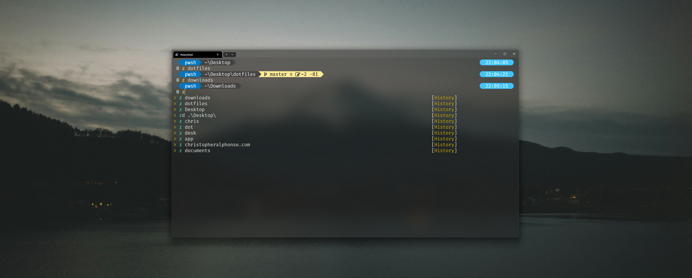
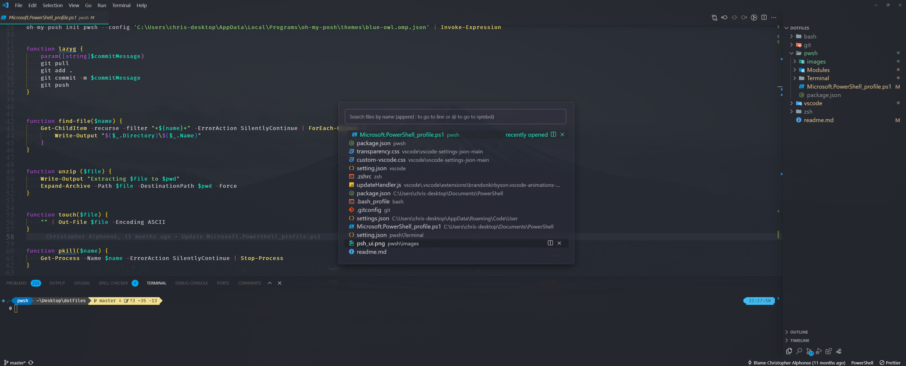
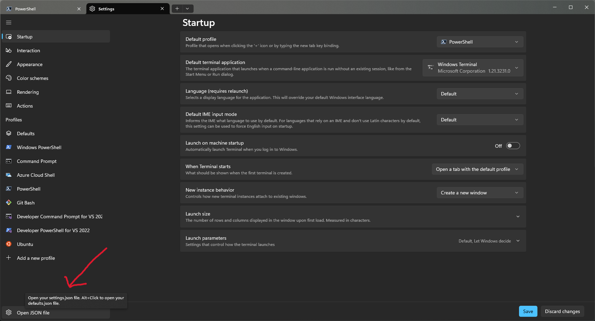

**Warning**: Don’t blindly use my settings unless you know what that entails. Use at your own risk! Although my settings cover for when I use Mac and Linux, this is focus on VScode and PWSH.

### Requirements

-[Powershell](https://apps.microsoft.com/detail/9MZ1SNWT0N5D?hl=en-us&gl=US&ocid=pdpshare)

## PowerShell setup (Windows)

- [Scoop](https://scoop.sh/) - A command-line installer
- [Git for Windows](https://gitforwindows.org/)
- [Oh My Posh](https://ohmyposh.dev/) - Prompt theme engine
- [Terminal Icons](https://github.com/devblackops/Terminal-Icons) - Folder and file icons
- [PSReadLine](https://docs.microsoft.com/en-us/powershell/module/psreadline/) - Cmdlets for customizing the editing environment, used for autocompletion
- [z](https://www.powershellgallery.com/packages/z) - Directory jumper
- [PSFzf](https://github.com/kelleyma49/PSFzf) - Fuzzy finder
- [PowershellGet](https://www.powershellgallery.com/packages/PowerShellGet/2.2.5) - Discovering, installing, updating and publishing the PowerShell artifacts

Install sudo to run admin command like in linux without launch terminal in admin mode.

```sh
 scoop install curl sudo jq
```

# Terminal

Copy and pate [settings.json](./pwsh/Terminal/setting.json) into the terminal json.


## Text

- Color scheme: Tango Dark
  - Font face: FiraMono NF
  - Font size: 18
  - Padding: 8

## Powershell -> Appearance

- Transparency
  - Background opacity: 51%
  - Enable acrylic material: on

## Visual Studio Code

- [Custom CSS and JS Loader](https://marketplace.visualstudio.com/items?itemName=be5invis.vscode-custom-css) - Allow to load custom CSS and JS to override the Electron default.
- [VSCode Animations](https://marketplace.visualstudio.com/items?itemName=BrandonKirbyson.vscode-animations) - Animated scroll, Smooth motions
- [Apc Customize UI++](https://marketplace.visualstudio.com/items?itemName=drcika.apc-extension) - Override Electron browser settings
- [Azalais Dark](https://marketplace.visualstudio.com/items?itemName=ChristopherAlphonse.azalais-dark-theme) - My theme
